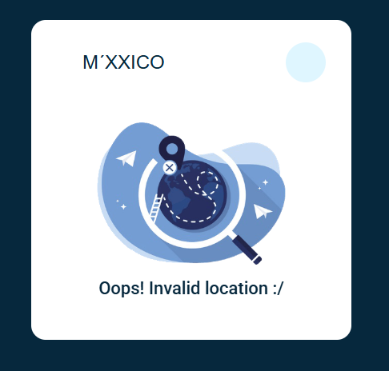
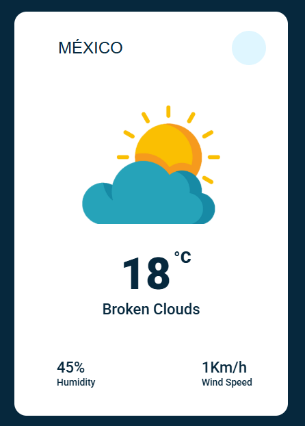

# Aplicativo de Medir Temperatura: é um aplicativo de previsão do tempo simples e funcional, feito com HTML, CSS e JavaScript, utilizando a API da OpenWeatherMap para obter dados meteorológicos em tempo real. Aqui vai um resumo por partes:

## 🔧 Tecnologias Utilizadas
### - HTML5: Estrutura básica da página.
### - CSS3: Estilização visual com foco em um design moderno, minimalista e limpo.
### - JavaScript (puro): Responsável por buscar os dados da API, tratar as respostas e atualizar a interface.

## API externa: OpenWeatherMap — usada para obter temperatura, clima, umidade e velocidade do vento.

## ⚙️ Como Funciona
### - O usuário digita o nome de uma cidade no campo de busca.
### - Ao clicar no botão de pesquisa (ou pressionar Enter, se implementado), o JavaScript envia uma requisição para a API do OpenWeatherMap.
### - A resposta da API retorna os dados do clima atual da cidade pesquisada.

## O app:

### + Atualiza o ícone do clima (sol, chuva, nuvens, etc).
### + Exibe a temperatura, descrição do clima, umidade e velocidade do vento.
### + Mostra uma tela de erro caso a cidade não seja encontrada.

## 🎨 Design e Experiência
### + Interface compacta e centralizada, ideal para uso em dispositivos móveis.
### + Animações suaves com a classe fadeIn para transições mais agradáveis.
### + Ícones do clima usando imagens locais e ícones gerais via Font Awesome.

  
  

